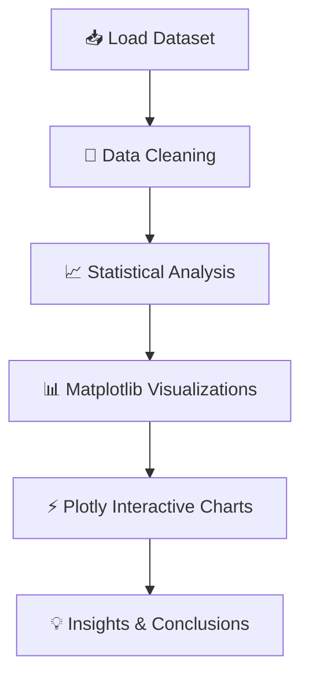

# 🚀 Advanced EDA Project — Student Performance Analytics

<div align="center">


<br>


</div>

---

# ✨ Project Overview

This project demonstrates a **complete Exploratory Data Analysis (EDA)** workflow using:

* 🐼 **Pandas** for data manipulation and statistical analysis
* 📈 **Matplotlib** for static visualizations
* ⚡ **Plotly** for interactive and modern charts

The dataset contains multiple subjects and performance metrics for different fictional characters.

---

# 📂 Dataset Structure

| Column | Description                  |
| ------ | ---------------------------- |
| Name   | Character Name               |
| NET    | Networking Marks             |
| Dev    | Development Marks            |
| WeD    | Web Designing Marks          |
| PWD    | Python Web Development Marks |
| JSC    | JavaScript Concepts Marks    |
| DVS    | Data Visualization Skills    |
| EVS    | Environmental Studies Marks  |

---

# 🧠 Dataset Preview

```python
mg = {
    'Name': ["Peter", "Quagmire", "Luois", "Stewie", "Brian", "Griffins", "Giant Dog", "Meg", "Obama", "Chris", "Leg", "Putin"],
    'NET': [51, 63, 59, 45, 85, 74, 95, 96, 23, 65, 22.2, 14],
    'Dev': [45, 52, 23, 14, 25, 63, 9, 74, 50, 63.2, 66, 12],
    'WeD': [36, 25, 5, 62, 19, 18, 55, 65, 44, 70, 69, 33.6],
    'PWD': [52, 66, 23, 12, 21, 41, 52, 25, 36, 45.6, 77, 63],
    'JSC': [25, 14, 52, 63, 45, 21, 85, 96, 45, 63, 55.3, 23],
    'DVS': [75, 85, 96, 5, 45, 63, 47, 65, 23.6, 52, 60, 50],
    'EVS': [30, 66, 56, 45, 32.3, 44, 51, 25, 36, 47, 58, 56]
}
```

---

# 🛠️ Technologies Used

<div align="center">

| Technology       | Purpose                   |
| ---------------- | ------------------------- |
| Python           | Programming Language      |
| Pandas           | Data Cleaning & Analysis  |
| Matplotlib       | Static Charts             |
| Plotly           | Interactive Visualization |
| Jupyter Notebook | Development Environment   |

</div>

---

# 📊 Exploratory Data Analysis Workflow

<div align="center">



</div>

---

# 🐼 Pandas Analysis

## ✔️ Operations Performed

* Dataset Creation
* Data Inspection
* Shape & Information Analysis
* Missing Value Checking
* Statistical Summary
* Sorting & Filtering
* Mean / Median / Mode Calculations
* Correlation Analysis
* Aggregation Operations

---

# 📈 Matplotlib Visualizations

## ✔️ Charts Created

* 📊 Bar Charts
* 📉 Line Graphs
* 🥧 Pie Charts
* 📦 Boxplots
* 📍 Scatter Plots
* 📚 Histograms
* 🌡️ Heatmaps

---

# ⚡ Plotly Interactive Visualizations

## ✔️ Interactive Charts

* Dynamic Scatter Plot
* Interactive Bar Graph
* 3D Charts
* Interactive Pie Charts
* Hover Enabled Analytics
* Zoomable Graphs
* Dashboard Style Charts

---

# 🔥 Sample Code

## 🐼 Pandas

```python
import pandas as pd

# Creating DataFrame

gh = pd.DataFrame(mg)

# Statistical Summary
print(gh.describe())

# Correlation Matrix
print(gh.corr(numeric_only=True))
```

---

## 📈 Matplotlib

```python
import matplotlib.pyplot as plt

plt.figure(figsize=(10,5))
plt.bar(gh['Name'], gh['NET'])
plt.xticks(rotation=45)
plt.title('Networking Scores')
plt.show()
```

---

## ⚡ Plotly

```python
import plotly.express as px

fig = px.scatter(
    gh,
    x='NET',
    y='Dev',
    color='Name',
    size='DVS',
    title='Interactive Analysis'
)

fig.show()
```

---

# 📌 Key Insights

✨ Students/characters with strong networking scores often perform well in development.

✨ Interactive visualizations make trend identification significantly easier.

✨ Correlation analysis helps identify subject dependencies.

✨ Plotly dashboards improve user engagement and understanding.

---

# 📁 Project Structure

```bash
📦 EDA-Project
 ┣ 📂 pandas_analysis
 ┃ ┗ 📜 pandas_eda.ipynb
 ┣ 📂 matplotlib_visualizations
 ┃ ┗ 📜 matplotlib_eda.ipynb
 ┣ 📂 plotly_visualizations
 ┃ ┗ 📜 plotly_eda.ipynb
 ┣ 📜 README.md
 ┗ 📜 requirements.txt
```

---

# ⚙️ Installation

## 1️⃣ Clone Repository

```bash
git clone https://github.com/your-username/EDA-Project.git
```

## 2️⃣ Install Dependencies

```bash
pip install pandas matplotlib plotly numpy
```

## 3️⃣ Run Notebook

```bash
jupyter notebook
```

---

# 🌟 Features

✅ Clean and professional EDA workflow
✅ Interactive visual analytics
✅ Beginner-friendly code structure
✅ Advanced visualization techniques
✅ Professional GitHub README design
✅ Animated typing effects and badges

---

# 📷 Recommended Screenshots Section

You can add screenshots here:

```md


```

---

# 🚀 Future Improvements

* Add Machine Learning Models
* Build Streamlit Dashboard
* Deploy Interactive App
* Add Real-Time Data Analysis
* Add Statistical Hypothesis Testing

---

# 🤝 Contribution

Contributions are welcome.

If you'd like to improve the project:

1. Fork the repository
2. Create a new branch
3. Commit changes
4. Push the branch
5. Open a Pull Request

---

# 📜 License

This project is licensed under the MIT License.

---

# 💻 Author

<div align="center">

## 🌟 Developed with Passion for Data Analytics 🌟


</div>
