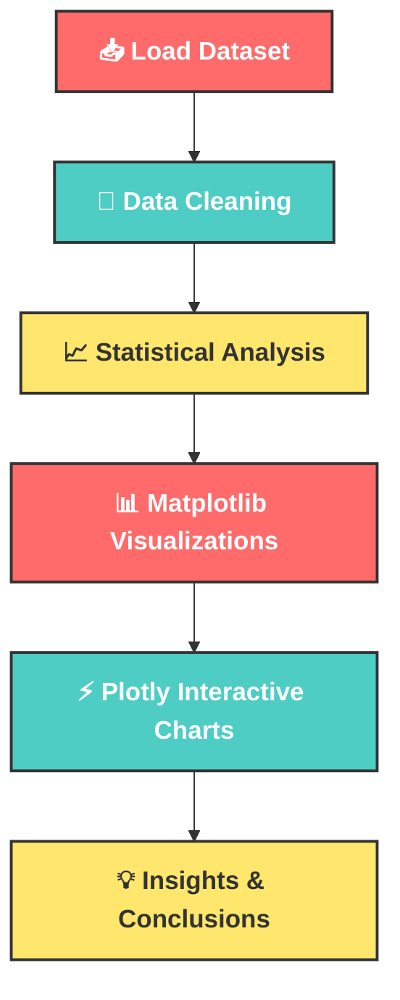

```markdown
<!-- Header with animated gradient banner and typing effect -->
<div align="center">
  
  

  

</div>

<!-- Animated Gradient Badges Row -->
<div align="center">
  
  
  
  
  
  
  
  
  <br>
  
  
  
  
  
</div>

<br>

<!-- Animated Gradient Line -->


<!-- Table of Contents with Neon Styling -->
<div align="center">
  
## 🔮 **TABLE OF CONTENTS** 🔮

| 🚀 Section | 📊 Section | 💡 Section |
|:----------:|:----------:|:----------:|
| [✨ Overview](#-project-overview) | [🐼 Pandas Analysis](#-pandas-analysis) | [📌 Key Insights](#-key-insights) |
| [📂 Dataset](#-dataset-structure) | [📈 Matplotlib](#-matplotlib-visualizations) | [📁 Structure](#-project-structure) |
| [🛠️ Tech Stack](#️-technologies-used) | [⚡ Plotly](#-plotly-interactive-visualizations) | [⚙️ Installation](#️-installation) |
| [🧠 Preview](#-dataset-preview) | [🔥 Code Samples](#-sample-code) | [🌟 Features](#-features) |

</div>


<!-- Main Overview Section -->
<div align="center">
  
## ✨ **PROJECT OVERVIEW** ✨

</div>

<div align="center">
  
  <table>
    <tr>
      <td align="center">
        
        <br/>🐍 Python
      </td>
      <td align="center">
        
        <br/>🐼 Pandas
      </td>
      <td align="center">
        
        <br/>📈 Matplotlib
      </td>
      <td align="center">
        
        <br/>⚡ Plotly
      </td>
    </tr>
  </table>
  
  <br>
  
  <p align="center">
    🎯 This project demonstrates a <strong style="color:#FF6B6B">complete Exploratory Data Analysis (EDA) workflow</strong> with:
  </p>
  
  <code>🔹 Data Manipulation & Statistical Analysis using Pandas</code><br>
  <code>🔹 Static Visualizations using Matplotlib</code><br>
  <code>🔹 Interactive & Modern Charts using Plotly</code><br>
  
</div>


<!-- Dataset Section with Colorful Table -->
<div align="center">
  
## 📂 **DATASET STRUCTURE** 📂

</div>

<div align="center">
  
| <span style="color:#FF6B6B">📌 Column</span> | <span style="color:#4ECDC4">📝 Description</span> |
|:--------------------------------------------:|:-------------------------------------------------:|
| **Name** | Character Name |
| **NET** | Networking Marks |
| **Dev** | Development Marks |
| **WeD** | Web Designing Marks |
| **PWD** | Python Web Development Marks |
| **JSC** | JavaScript Concepts Marks |
| **DVS** | Data Visualization Skills |
| **EVS** | Environmental Studies Marks |

</div>


<!-- Dataset Preview -->
<div align="center">
  
## 🧠 **DATASET PREVIEW** 🧠

</div>

```python
mg = {
    'Name': ["Peter", "Quagmire", "Luois", "Stewie", "Brian", "Griffins", 
             "Giant Dog", "Meg", "Obama", "Chris", "Leg", "Putin"],
    'NET': [51, 63, 59, 45, 85, 74, 95, 96, 23, 65, 22.2, 14],
    'Dev': [45, 52, 23, 14, 25, 63, 9, 74, 50, 63.2, 66, 12],
    'WeD': [36, 25, 5, 62, 19, 18, 55, 65, 44, 70, 69, 33.6],
    'PWD': [52, 66, 23, 12, 21, 41, 52, 25, 36, 45.6, 77, 63],
    'JSC': [25, 14, 52, 63, 45, 21, 85, 96, 45, 63, 55.3, 23],
    'DVS': [75, 85, 96, 5, 45, 63, 47, 65, 23.6, 52, 60, 50],
    'EVS': [30, 66, 56, 45, 32.3, 44, 51, 25, 36, 47, 58, 56]
}
```


<!-- Tech Stack with Glowing Cards -->
<div align="center">
  
## 🛠️ **TECHNOLOGIES USED** 🛠️

<br>

<table align="center">
  <tr>
    <td align="center" width="200">
      
      <br/><strong style="color:#FFD43B">🐍 Python</strong>
      <br/>Programming Language
    </td>
    <td align="center" width="200">
      
      <br/><strong style="color:#150458">🐼 Pandas</strong>
      <br/>Data Cleaning & Analysis
    </td>
    <td align="center" width="200">
      
      <br/><strong style="color:#FF6B6B">📈 Matplotlib</strong>
      <br/>Static Charts
    </td>
  </tr>
  <tr>
    <td align="center" width="200">
      
      <br/><strong style="color:#3F4F75">⚡ Plotly</strong>
      <br/>Interactive Visualization
    </td>
    <td align="center" width="200">
      
      <br/><strong style="color:#F37626">📓 Jupyter</strong>
      <br/>Development Environment
    </td>
    <td align="center" width="200">
      
      <br/><strong style="color:#4ECDC4">🔢 NumPy</strong>
      <br/>Numerical Computing
    </td>
  </tr>
</table>

</div>


<!-- EDA Workflow with Mermaid -->
<div align="center">
  
## 📊 **EXPLORATORY DATA ANALYSIS WORKFLOW** 📊

</div>

<div align="center">



</div>


<!-- Pandas Analysis -->
<div align="center">
  
## 🐼 **PANDAS ANALYSIS** 🐼

</div>

<div align="center">
  
| <span style="color:#FF6B6B">✔️ Operations Performed</span> |
|:----------------------------------------------------------:|
| 📥 Dataset Creation |
| 🔍 Data Inspection |
| 📏 Shape & Information Analysis |
| ❓ Missing Value Checking |
| 📊 Statistical Summary |
| 🔄 Sorting & Filtering |
| 📈 Mean / Median / Mode Calculations |
| 🔗 Correlation Analysis |
| 🔢 Aggregation Operations |

</div>


<!-- Matplotlib Visualizations -->
<div align="center">
  
## 📈 **MATPLOTLIB VISUALIZATIONS** 📈

</div>

<div align="center">
  
| <span style="color:#4ECDC4">🎨 Charts Created</span> |
|:----------------------------------------------------:|
| 📊 Bar Charts |
| 📉 Line Graphs |
| 🥧 Pie Charts |
| 📦 Boxplots |
| 📍 Scatter Plots |
| 📚 Histograms |
| 🌡️ Heatmaps |

</div>


<!-- Plotly Interactive -->
<div align="center">
  
## ⚡ **PLOTLY INTERACTIVE VISUALIZATIONS** ⚡

</div>

<div align="center">
  
| <span style="color:#FFE66D">🎮 Interactive Charts</span> |
|:-------------------------------------------------------:|
| Dynamic Scatter Plot |
| Interactive Bar Graph |
| 3D Charts |
| Interactive Pie Charts |
| Hover Enabled Analytics |
| Zoomable Graphs |
| Dashboard Style Charts |

</div>


<!-- Sample Code Section -->
<div align="center">
  
## 🔥 **SAMPLE CODE** 🔥

</div>

<!-- Three Column Code Blocks -->
<table>
  <tr>
    <td width="33%" align="center"><strong style="color:#FF6B6B">🐼 Pandas Analysis</strong></td>
    <td width="33%" align="center"><strong style="color:#4ECDC4">📈 Matplotlib Charts</strong></td>
    <td width="33%" align="center"><strong style="color:#FFE66D">⚡ Plotly Interactive</strong></td>
  </tr>
  <tr>
    <td width="33%">
      
```python
import pandas as pd

# Creating DataFrame
gh = pd.DataFrame(mg)

# Statistical Summary
print(gh.describe())

# Correlation Matrix
print(gh.corr(numeric_only=True))
```
    </td>
    <td width="33%">
      
```python
import matplotlib.pyplot as plt

plt.figure(figsize=(10,5))
plt.bar(gh['Name'], gh['NET'])
plt.xticks(rotation=45)
plt.title('Networking Scores')
plt.show()
```
    </td>
    <td width="33%">
      
```python
import plotly.express as px

fig = px.scatter(
    gh,
    x='NET',
    y='Dev',
    color='Name',
    size='DVS',
    title='Interactive Analysis'
)

fig.show()
```
    </td>
  </tr>
</table>


<!-- Key Insights -->
<div align="center">
  
## 📌 **KEY INSIGHTS** 📌

</div>

<div align="center">
  
| <span style="color:#FF6B6B">💡 Insight</span> | <span style="color:#4ECDC4">🔍 Finding</span> |
|:---------------------------------------------:|:---------------------------------------------:|
| 🎯 **Performance Correlation** | Students/characters with strong networking scores often perform well in development |
| 📊 **Interactive Advantage** | Interactive visualizations make trend identification significantly easier |
| 🔗 **Dependency Mapping** | Correlation analysis helps identify subject dependencies |
| 🚀 **User Engagement** | Plotly dashboards improve user engagement and understanding |

</div>


<!-- Project Structure -->
<div align="center">
  
## 📁 **PROJECT STRUCTURE** 📁

</div>

```bash
📦 EDA-Project
 ┣ 📂 pandas_analysis
 ┃ ┗ 📜 pandas_eda.ipynb
 ┣ 📂 matplotlib_visualizations
 ┃ ┗ 📜 matplotlib_eda.ipynb
 ┣ 📂 plotly_visualizations
 ┃ ┗ 📜 plotly_eda.ipynb
 ┣ 📂 data
 ┃ ┗ 📜 student_performance.csv
 ┣ 📂 images
 ┃ ┣ 📜 dashboard.png
 ┃ ┗ 📜 plots.png
 ┣ 📜 README.md
 ┗ 📜 requirements.txt
```


<!-- Installation -->
<div align="center">
  
## ⚙️ **INSTALLATION** ⚙️

</div>

<div align="center">
  
### **1️⃣ Clone Repository**
```bash
git clone https://github.com/your-username/EDA-Project.git
cd EDA-Project
```

### **2️⃣ Install Dependencies**
```bash
pip install pandas matplotlib plotly numpy jupyter
```

### **3️⃣ Run Notebook**
```bash
jupyter notebook
```

</div>


<!-- Features Section -->
<div align="center">
  
## 🌟 **FEATURES** 🌟

</div>

<div align="center">
  
| <span style="color:#FF6B6B">✅ Feature</span> | <span style="color:#4ECDC4">📝 Description</span> |
|:---------------------------------------------:|:-------------------------------------------------:|
| 🎯 **Professional Workflow** | Clean and professional EDA workflow |
| 📊 **Interactive Analytics** | Interactive visual analytics with Plotly |
| 👶 **Beginner Friendly** | Beginner-friendly code structure |
| 🚀 **Advanced Techniques** | Advanced visualization techniques |
| 🎨 **Modern Design** | Professional GitHub README design |
| ✨ **Animated Elements** | Animated typing effects and badges |

</div>


<!-- Screenshots Section -->
<div align="center">
  
## 📷 **SCREENSHOTS** 📷

</div>

<div align="center">
  
| <span style="color:#FFE66D">Dashboard View</span> | <span style="color:#4ECDC4">Interactive Plots</span> |
|:-------------------------------------------------:|:----------------------------------------------------:|
|  |  |

</div>


<!-- Future Improvements -->
<div align="center">
  
## 🚀 **FUTURE IMPROVEMENTS** 🚀

</div>

<div align="center">
  
- 🤖 Add Machine Learning Models
- 🌐 Build Streamlit Dashboard
- ☁️ Deploy Interactive App
- 📡 Add Real-Time Data Analysis
- 📊 Add Statistical Hypothesis Testing

</div>


<!-- Contribution -->
<div align="center">
  
## 🤝 **CONTRIBUTION** 🤝

</div>

<div align="center">
  
Contributions are **welcome**! 

If you'd like to improve the project:

1. 🔱 Fork the repository
2. 🌿 Create a new branch
3. 💾 Commit your changes
4. 📤 Push the branch
5. 🔄 Open a Pull Request

</div>


<!-- License -->
<div align="center">
  
## 📜 **LICENSE** 📜

</div>

<div align="center">
  
This project is licensed under the **MIT License**.

</div>


<!-- Author Footer with Animated Social Links -->
<div align="center">
  
## 💻 **AUTHOR** 💻

### 🌟 **Developed with Passion for Data Analytics** 🌟

<br>

<div align="center">
  <a href="https://github.com/your-username">
    
  </a>
  <a href="https://linkedin.com/in/your-profile">
    
  </a>
  <a href="https://twitter.com/your-handle">
    
  </a>
  <a href="mailto:your-email@example.com">
    
  </a>
</div>

<br>


<br>

<!-- Snake Contribution Graph -->


<br>

<!-- Animated Footer Wave -->


</div>
```
